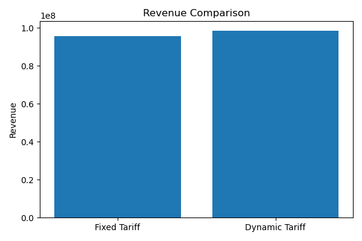
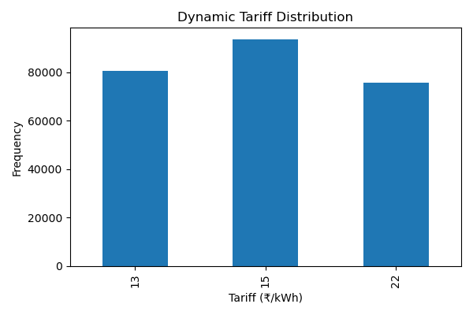

# Agentic AI Framework for Dynamic EV Charging Tariff Optimization

## Overview

This project develops an Agentic AI framework for Dynamic EV Charging Tariff Optimization using large-scale EV charging network data. The framework forecasts charging demand, predicts congestion, recommends adaptive tariffs, and continuously evaluates operational performance through a monitoring and learning system.

As EV adoption grows, static charging tariffs lead to peak-hour congestion, underutilized infrastructure during off-peak periods, and suboptimal revenue generation. This project addresses these challenges through data-driven forecasting and dynamic pricing strategies.

---

## Problem Statement

Traditional EV charging stations typically operate using fixed-rate pricing regardless of real-time demand and charger utilization.

Key challenges include:

* Peak-hour congestion and long waiting times
* Underutilization during off-peak periods
* Revenue inefficiencies
* Poor load balancing across charging infrastructure

This project develops an AI-driven framework capable of:

* Forecasting charging demand
* Predicting charger utilization
* Detecting congestion
* Recommending dynamic tariffs
* Monitoring pricing effectiveness

---

## Dataset

### UrbanEV Charging Dataset

The primary dataset contains large-scale charging infrastructure information.

**Dataset Statistics**

* 2.12 Million charging observations
* 247 charging zones
* 5-minute charging intervals
* Occupancy information
* Charging volume data
* Charging duration data
* Charging price information

### Station Information

Station-level attributes include:

* Latitude
* Longitude
* Number of Fast Chargers
* Number of Slow Chargers
* Total Charger Count

---

## Data Preprocessing

The following preprocessing steps were performed:

* Reshaped wide-format charging data into long format
* Merged occupancy, volume, duration, and pricing datasets
* Integrated station metadata
* Removed missing values
* Generated temporal features
* Created lag-based demand features
* Engineered rolling-window demand indicators

### Engineered Features

#### Temporal Features

* Hour
* Weekday
* Month
* Weekend Indicator

#### Demand Features

* Occupancy Density
* Utilization Rate
* Congestion Indicator

#### Lag Features

* Occupancy Lag (1 period)
* Occupancy Lag (24 periods)
* Volume Lag (1 period)
* Volume Lag (24 periods)
* Duration Lag (1 period)
* Duration Lag (24 periods)

#### Rolling Features

* 24-Period Occupancy Rolling Average
* 24-Period Volume Rolling Average
* 24-Period Duration Rolling Average

---

## Agent Architecture

### 1. Demand Prediction Agent

This agent predicts future charging demand and utilization.

#### Targets

* Charger Utilization Rate
* Charging Volume

#### Model

Random Forest Regressor

#### Results

| Target           | Metric | Value |
| ---------------- | ------ | ----: |
| Utilization Rate | R²     | 0.943 |
| Charging Volume  | R²     | 0.994 |

---

### 2. Congestion Prediction Agent

This agent identifies charging stations likely to experience congestion.

#### Output

* Congested
* Non-Congested

#### Model

Random Forest Classifier

#### Results

| Metric    |  Value |
| --------- | -----: |
| Accuracy  | 0.9951 |
| Precision | 0.9964 |
| Recall    | 0.9952 |
| F1 Score  | 0.9958 |
| AUC       | 0.9999 |

---

### 3. Dynamic Tariff Pricing Agent

This agent generates adaptive pricing recommendations based on forecasted demand.

#### Pricing Logic

| Utilization Level | Action           |
| ----------------- | ---------------- |
| > 80%             | Surge Pricing    |
| 30% – 80%         | Base Pricing     |
| < 30%             | Discount Pricing |

#### Objectives

* Maximize Revenue
* Reduce Congestion
* Improve Infrastructure Utilization
* Encourage Off-Peak Charging

---

### 4. Monitoring & Learning Agent

The monitoring agent evaluates pricing effectiveness and operational outcomes.

#### Tracked Metrics

* Revenue Gain
* Customer Response Rate
* Pricing Efficiency
* Wait-Time Reduction

---

## Key Results

| Metric                      |  Value |
| --------------------------- | -----: |
| Utilization Model R²        |  0.943 |
| Volume Forecasting Model R² |  0.994 |
| Congestion Detection AUC    | 0.9999 |
| Revenue Improvement         |  3.14% |
| Wait-Time Reduction         | 16.56% |
| Customer Response Rate      |  0.764 |

---

## Visualizations

### Revenue Comparison



### Tariff Distribution



### Occupancy Density


### Feature Importance


---

## Technologies Used

### Programming

* Python

### Data Processing

* Pandas
* NumPy

### Machine Learning

* Scikit-Learn
* Random Forest Regressor
* Random Forest Classifier

### Visualization

* Matplotlib

---

## Repository Structure

```text
agentic-ai-ev-tariff-optimization/

│
├── notebook.ipynb
├── README.md
├── LICENSE
│
├── executive_summary.csv
├── final_model_results.csv
├── project_summary_metrics.csv
│
├── revenue_comparison.png
├── tariff_distribution.png
├── occupancy_density.png
├── feature_importance.png
│
├── utilization_results.csv
├── volume_results.csv
├── utilization_feature_importance.csv
├── volume_feature_importance.csv
├── congestion_feature_importance.csv
```

---

## Business Impact

The proposed framework demonstrates how AI-driven tariff optimization can improve EV charging network performance by:

* Increasing charging infrastructure utilization
* Reducing congestion during peak periods
* Improving revenue generation
* Encouraging off-peak charging behavior
* Supporting scalable EV infrastructure management

---

## Future Improvements

Potential future extensions include:

* Reinforcement Learning based tariff optimization
* Real-time pricing deployment
* Demand elasticity modeling
* Grid-aware charging optimization
* Multi-agent coordination across charging zones

---

## Author

**B. Mithun**

Mechanical Engineering
Indian Institute of Technology Roorkee

Self Project – Agentic AI Framework for Dynamic EV Charging Tariff Optimization
