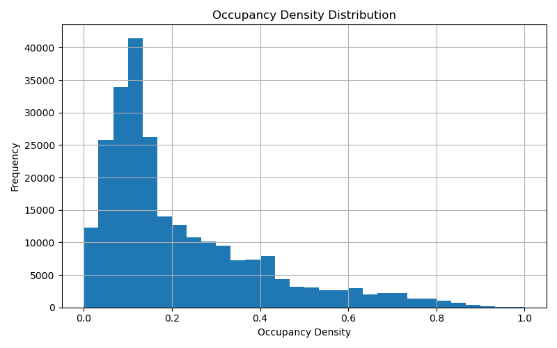
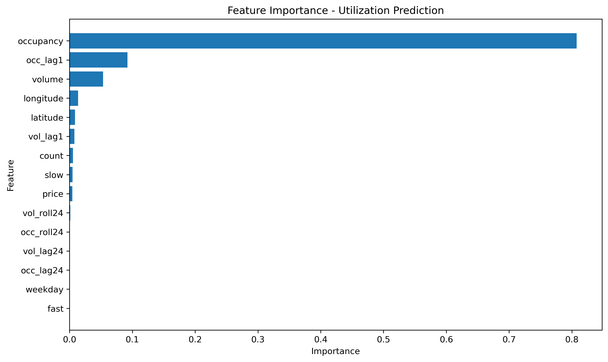

# Agentic AI Framework for Dynamic EV Charging Tariff Optimization

## Overview

This project develops an Agentic AI framework for Dynamic EV Charging Tariff Optimization using large-scale EV charging network data. The system forecasts charging demand, predicts congestion, recommends adaptive tariffs, and evaluates operational performance through a monitoring and learning agent.

As EV adoption increases, fixed charging tariffs often result in peak-hour congestion, underutilized infrastructure during off-peak periods, and suboptimal revenue generation. This project addresses these challenges through machine learning-based demand forecasting and dynamic pricing strategies.

---

## Problem Statement

Traditional EV charging stations typically operate with fixed pricing regardless of demand and charger utilization.

This leads to:

- Peak-hour congestion
- Long customer waiting times
- Revenue inefficiencies
- Uneven charger utilization

The objective of this project is to:

- Forecast charging demand
- Predict charger utilization
- Detect congestion
- Recommend dynamic tariffs
- Monitor pricing effectiveness

---

## Dataset

### UrbanEV Charging Dataset

Dataset Statistics:

- 2.12 Million charging observations
- 247 charging zones
- Occupancy information
- Charging volume data
- Charging duration data
- Electricity pricing data

### Station Information

Station-level features include:

- Latitude
- Longitude
- Fast charger count
- Slow charger count
- Total charger count

---

## Data Preprocessing

The following preprocessing steps were performed:

- Reshaped charging datasets into a unified format
- Merged occupancy, volume, duration, and pricing data
- Integrated station metadata
- Removed missing values
- Created temporal features
- Generated lag-based demand features
- Engineered rolling-window features

### Engineered Features

#### Temporal Features

- Hour
- Weekday
- Month
- Weekend Indicator

#### Demand Features

- Occupancy Density
- Utilization Rate
- Congestion Indicator

#### Lag Features

- Occupancy Lag 1
- Occupancy Lag 24
- Volume Lag 1
- Volume Lag 24
- Duration Lag 1
- Duration Lag 24

#### Rolling Features

- 24-Period Occupancy Rolling Average
- 24-Period Volume Rolling Average
- 24-Period Duration Rolling Average

---

## Agent Architecture

### 1. Demand Prediction Agent

Forecasts future charger utilization and charging demand.

#### Model

Random Forest Regressor

#### Results

| Target | Metric | Value |
|----------|----------|----------:|
| Utilization Rate | R² | 0.943 |
| Charging Volume | R² | 0.994 |

---

### 2. Congestion Prediction Agent

Identifies stations likely to experience congestion.

#### Model

Random Forest Classifier

#### Results

| Metric | Value |
|----------|----------:|
| Accuracy | 0.9951 |
| Precision | 0.9964 |
| Recall | 0.9952 |
| F1 Score | 0.9958 |
| AUC | 0.9999 |

---

### 3. Dynamic Tariff Pricing Agent

Generates adaptive pricing recommendations based on predicted utilization.

#### Pricing Logic

| Utilization Level | Action |
|----------|----------|
| > 80% | Surge Pricing |
| 30% – 80% | Base Pricing |
| < 30% | Discount Pricing |

#### Objectives

- Maximize Revenue
- Reduce Congestion
- Improve Infrastructure Utilization
- Encourage Off-Peak Charging

---

### 4. Monitoring & Learning Agent

Evaluates pricing effectiveness and operational outcomes.

#### Tracked Metrics

- Revenue Gain
- Customer Response Rate
- Pricing Efficiency
- Wait-Time Reduction

---

## Key Results

| Metric | Value |
|----------|----------:|
| Utilization Prediction R² | 0.943 |
| Charging Volume Prediction R² | 0.994 |
| Congestion Detection AUC | 0.9999 |
| Revenue Improvement | 3.14% |
| Wait-Time Reduction | 16.56% |
| Customer Response Rate | 0.764 |

---

## Visualizations

### Revenue Comparison


### Tariff Distribution


### Occupancy Density



### Utilization Model Feature Importance



---

## Technologies Used

### Programming

- Python

### Data Processing

- Pandas
- NumPy

### Machine Learning

- Scikit-Learn
- Random Forest Regressor
- Random Forest Classifier

### Visualization

- Matplotlib

---

## Repository Structure

```text
agentic-ai-ev-tariff-optimization/

│
├── notebooks/
│   └── notebook.ipynb
│
├── results/
│   ├── executive_summary.csv
│   ├── final_model_results.csv
│   ├── project_summary_metrics.csv
│   ├── utilization_results.csv
│   └── volume_results.csv
│
├── figures/
│   ├── revenue_comparison.png
│   ├── tariff_distribution.png
│   ├── occupancy_density.png
│   └── feature_importance.png
│
├── feature_importance/
│   ├── utilization_feature_importance.csv
│   ├── volume_feature_importance.csv
│   └── congestion_feature_importance.csv
│
├── README.md
├── requirements.txt
└── LICENSE
```

---

## Business Impact

This framework demonstrates how AI-driven dynamic pricing can improve EV charging network performance by:

- Increasing charger utilization
- Reducing peak-hour congestion
- Improving revenue generation
- Encouraging off-peak charging behavior
- Supporting scalable EV infrastructure management

---

## Future Improvements

Potential future extensions include:

- Reinforcement Learning based pricing
- Real-time tariff deployment
- Demand elasticity modeling
- Grid-aware charging optimization
- Multi-agent coordination across charging zones

---

## Author

**B MITHUN**

Mechanical Engineering  
Indian Institute of Technology Roorkee

Self Project – Agentic AI Framework for Dynamic EV Charging Tariff Optimization
